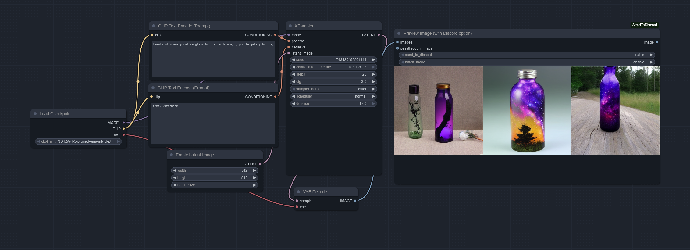

# ComfyUI-SendToDiscord

ComfyUI-SendToDiscord is a custom node for [ComfyUI](https://github.com/comfyanonymous/ComfyUI) that simplifies sending preview images to Discord via webhooks. It supports both single-image uploads and batch mode, making it an efficient tool for sharing your generated images directly with your Discord server.


- Workflow included in the image

## Features
- Send individual or batches of images directly to a Discord channel via webhooks.
- Includes metadata (e.g., prompts and additional PNG information) in saved images.
- Configurable batch size and compression level.
- Simple setup with a `config.ini` file for webhook URL configuration.

## Requirements
- Python 3.10+
- `Pillow`, `requests`, and `numpy` libraries (automatically installed via `requirements.txt`).

## Installation

1. Clone the repository into your ComfyUI custom nodes directory:
    ```bash
    git clone https://github.com/yourusername/ComfyUI-SendToDiscord.git
    ```
2. Install dependencies:
    ```bash
    pip install -r requirements.txt
    ```
3. Add your Discord webhook URL to the `config.ini` file located in the root directory:
    ```ini
    # Configuration file for ComfyUI-SendToDiscord
    # Replace 'your-webhook-url-here' with your Discord webhook URL.
    [Discord]
    webhook_url = https://discord.com/api/webhooks/your-webhook-id
    ```
### Dependencies
This node has been tested with the following Python packages:

- `Pillow>=9.5.0`
- `requests>=2.28.2`
- `numpy>=1.23.5`

If you encounter issues, please ensure these versions or higher are installed, or consult the official ComfyUI documentation for compatible dependencies.

## Usage

1. Open ComfyUI.
2. Add the "Preview Image (with Discord option)" node to your workflow.
3. Configure the node parameters:
    - **Send to Discord**: Enable or disable image uploads to Discord.
    - **Batch Mode**: Enable to accumulate images and send them in a single batch.
4. Generate your images, and they will be uploaded automatically to the specified Discord channel.

## Configuration

The node uses the following parameters:

- **images**: The list of images to process.
- **send_to_discord**: Enable or disable sending images to Discord (enable/disable).
- **batch_mode**: Accumulate images and send them as a batch (enable/disable).

## Example Workflow

You can add this node after your image generation process to preview and share your results directly.

## License

This project is licensed under the MIT License. See the [LICENSE](LICENSE) file for details.
